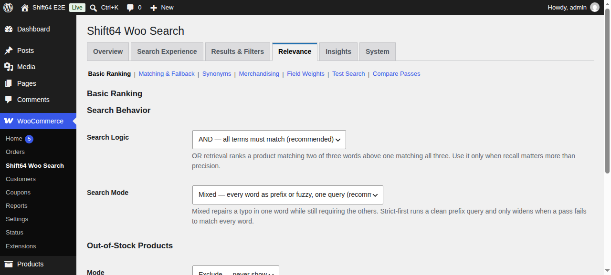
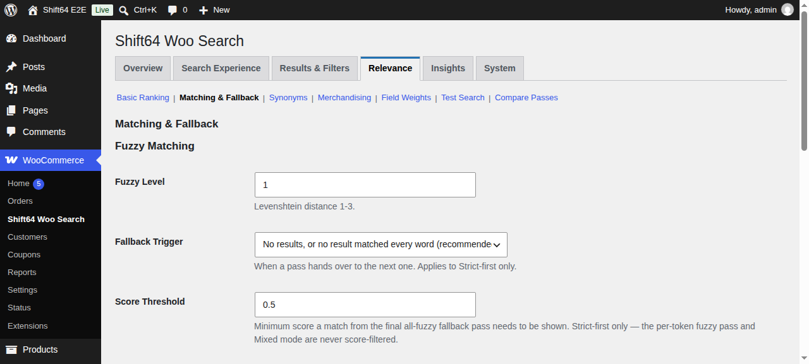
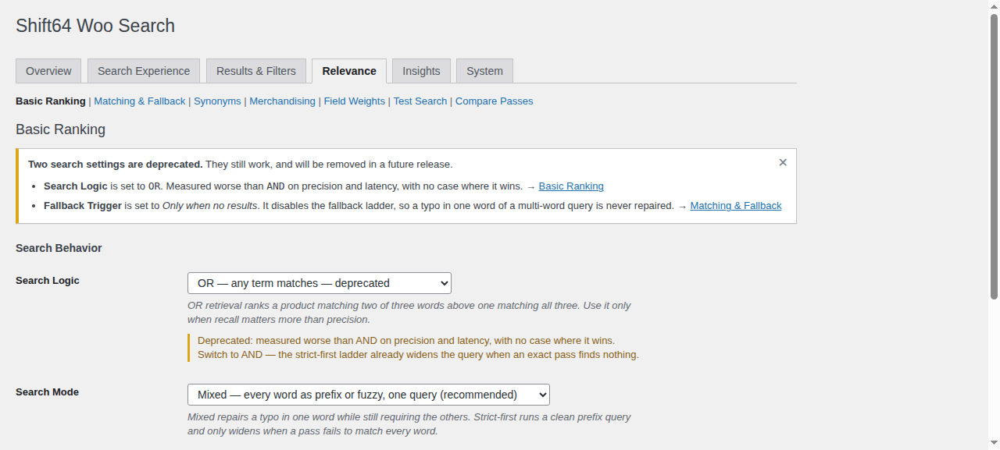
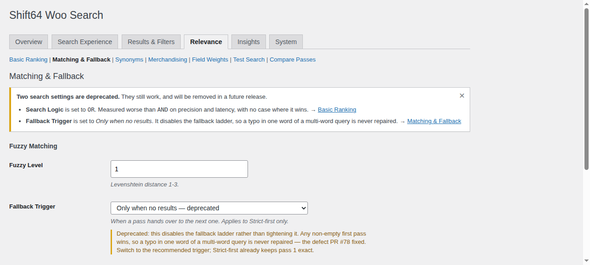

# Deprecate `logic = OR` and `fallback_trigger = no_results`

> **Status:** 🚧 draft

## 📝 TLDR

Two stored search settings measured worse than their alternatives on every axis
tried and have no case where they win (issue #85). This spec marks
`shift64_woo_search_logic = OR` and
`shift64_woo_search_fallback_trigger = no_results` as **deprecated** without
changing what they do: the values stay selectable and stay honored at runtime,
the admin labels them, a stateless notice tells a store that already has one
stored, and `wp shift64-woo-search health` reports the same thing for headless
operators. Removal is deliberately *not* in this spec — the deprecation window
exists to collect evidence from real catalogs first.

## 📝 Problem Statement

Issue #85 measured both values during the manual QA pass for #78, on the 100k
product dev catalog:

| | `AND` | `OR` |
|---|---|---|
| probe matrix (11 queries) | 11/11 correct | 9/11 |
| `aero cedat` under `no_results` | Aero Cedar products | "Aero Hector Skirt Ribbed Deep Navy" |
| latency, typical query | 1–3 ms | 17–25 ms |

`OR` loses precision *and* latency, and the recall argument that would justify
it does not survive contact with the data: a three-word `OR` query expands to
tens of thousands of candidates while the pipeline over-fetches only 300 rows
before ranking, so the products that would justify the wider net are frequently
outside the fetch window. `AND` already widens on demand — the `strict_first`
ladder's `or_prefix` pass relaxes term logic exactly when the `AND` pass found
nothing.

`fallback_trigger = no_results` is worse than useless: its stated intent ("do
not show approximate matches while exact ones exist") is what `strict_first`
already guarantees structurally, and as a separate axis it does not add that
guarantee — it *removes the ladder*. Any non-empty first pass wins, so a typo in
one word of a multi-word query is never repaired. That is precisely the defect
PR #78 fixed, reachable again through a dropdown.

PR #78 shipped advisory help text on both settings, which protects new installs
that read it. It does nothing for the stores that already have these values
stored, and nothing marks the values themselves as a dead end.

Left alone this is a support-surface problem: ~40 options is already a large
configuration surface, and a setting nobody can set correctly is mostly a way to
configure the plugin into misbehaving and then report it as a bug.

## 📝 Proposed Solution

Add a **deprecation registry** — one small, internal map of
`option → deprecated value → reason` — and render it on the three surfaces a
merchant or operator actually looks at:

1. **The select field** — the deprecated choice keeps its place in the dropdown
   but reads `… — deprecated`, so the label carries the verdict rather than only
   the help text underneath it.
2. **A stateless admin notice** on the plugin's own pages, shown only when the
   store currently has a deprecated value stored, naming each one and linking to
   the section that owns it.
3. **`wp shift64-woo-search health`** — one `WP_CLI::warning()` per stored
   deprecated value, because a headless or CI-managed store never sees an admin
   notice, and `health` is the diagnostic the docs already point at.

**Nothing about retrieval changes.** The query builder, the archive
interceptor, the SHORTINIT endpoint, and the generated mu-plugin config all keep
reading and honoring the stored values exactly as they do today. "Deprecated"
here means *documented as going away*, not *degraded*.

### Alternatives considered

- **Remove the values now.** Rejected: issue #85 itself scopes its evidence to
  one synthetic catalog with very regular `[Prefix] [Series] [Item] [Spec]
  [Finish]` naming, and flags that a store with long descriptive titles, heavy
  synonym use, or mixed languages could behave differently — particularly under
  `OR`. `BACKWARD_COMPATIBILITY.md` §6 also makes a behavior-altering default
  change a breaking change requiring a `shift64_woo_search_db_version` migration.
  The deprecation window is where that evidence gets collected.
- **Hide the deprecated value from the dropdown unless it is the stored value.**
  Rejected as the default: it strands a merchant who is mid-comparison and
  wants to switch back, and it is a larger UI behavior change than the issue
  asks for. Cheap to add later if adoption does not fall.
- **Fire `_doing_it_wrong()` / `_deprecated_argument()` at runtime.** Rejected:
  those are code-facing APIs, and a search setting is read on every query — it
  would write to `debug.log` on every front-end search while telling the one
  audience (developers) that cannot fix a merchant's stored option.
- **A general settings-deprecation framework** (per-field metadata, schema
  driven). Rejected as over-built: two values do not earn a framework, and the
  registry below collapses to one array if a third ever appears.

## 📝 Architecture

### New: the deprecation registry

`includes/class-shift64-woo-search-deprecations.php` —
`Shift64_Woo_Search_Deprecations`, a stateless static class with two methods:

- `registry()` → `array<string option, array<string value, string reason>>`, the
  declared set of deprecated option values and the one-sentence merchant-facing
  reason for each.
- `stored()` → the subset of `registry()` whose value is what the store
  currently has in options, in registry order, each entry carrying the option
  name, the stored value, the reason, and the admin route
  (`workspace`, `section`) that owns the field.

**Why a new class rather than `Shift64_Woo_Search_Settings`.** That class's
docblock scopes it deliberately: it is the *single reader of the search
configuration*, and it documents that the SHORTINIT endpoint intentionally does
not use it. A deprecation registry is admin/diagnostic metadata read by the
admin screens and WP-CLI — never by the query path and never by SHORTINIT.
Folding it in would widen a remit whose narrowness is the documented point.
Small single-purpose classes are the house pattern here
(`class-shift64-woo-search-pill-style.php`,
`class-shift64-woo-search-facet-eligibility.php`).

### Changed: the select-field primitive

`Shift64_Woo_Search_Admin::render_select_field()` gains one optional trailing
parameter, `$deprecated = array()` (`value => reason`). When present it:

- appends the translated `— deprecated` suffix to those option labels, and
- when the **stored** value is one of them, renders an additional
  `
` carrying
  the reason.

Extending the existing renderer keeps every settings field going through one
primitive; a parallel `render_deprecated_select_field()` would be the invention
the review heuristics warn about. The parameter is optional and trailing, so
every existing call site is untouched.

### Changed: the admin page shell

`Shift64_Woo_Search_Admin::render_page()` calls a new
`render_deprecated_settings_notice()` alongside the existing relocation notice,
before the section callback dispatch. It renders on **every** plugin workspace,
not only the two sections that own the fields — a merchant who has `OR` stored
should learn it from wherever they land, and the notice links them to the field.

**Stateless, by contract.** The relocation notice's docblock establishes that
"rendering a route never writes" — remembering a dismissal would mean writing
user meta or an option on a page view. This notice inherits that rule: markup
`is-dismissible` and nothing more. It reappears on reload and disappears for
good when the merchant changes the setting, which is the correct trigger.

### Changed: the CLI health command

`Shift64_Woo_Search_CLI::health()` grows a final deprecation block: one
`WP_CLI::warning()` per `stored()` entry, or a single `WP_CLI::log( 'Deprecated
settings: none' )` line when clean. This matches how `health()` already reports
the RediSearch-module check, and mirrors `BACKWARD_COMPATIBILITY.md` §2, which
names `WP_CLI::warning()` as this project's deprecation channel. `health()` is
diagnostic-only, so a warning never changes its exit status.

### Unchanged

`Shift64_Woo_Search_Settings::search_config()`,
`Shift64_Woo_Search_Query`, `Shift64_Woo_Search_Archive`,
`mu-plugins/endpoint.php`, and `generate_mu_plugin_config()` are not touched.
This is the load-bearing invariant of the whole spec and it gets its own
regression test.

## 📝 Data Model

**No schema change, no migration, no new option, no `db_version` bump.** The
registry is code, not stored state. Deprecation is derived at read time from
options that already exist:

| Option | Deprecated value | Recommended value | Default (unchanged) |
|---|---|---|---|
| `shift64_woo_search_logic` | `OR` | `AND` | `AND` |
| `shift64_woo_search_fallback_trigger` | `no_results` | `low_score` | `low_score` |

Both defaults already point at the recommended value as of PR #78, so a store
that never touched either setting sees no notice and no warning.

## 📝 API Contracts

No public surface changes. Per `BACKWARD_COMPATIBILITY.md`:

- **§6 Options** — no key is renamed, retyped, or re-defaulted; both values stay
  writable and readable. The doc gains a short "deprecated values" note under §6
  recording the two entries and that they still work.
- **§1 SHORTINIT endpoint** and **§4 generated mu-plugin config** — untouched;
  the constants are still emitted from the stored values.
- **§2 WP-CLI** — `health` gains output lines. Adding a warning line to a
  diagnostic command is additive; no command, flag, or exit status changes.
- **§5 Hooks** — none added or deprecated.

`Shift64_Woo_Search_Deprecations` is internal. It is not a documented extension
point and carries no compatibility promise.

## 📝 UI/UX

### 📸 Visuals

Current state, captured from the one-shot test environment at
`bin/test-env.sh up`:

| | |
|---|---|
|  |  |
| *Relevance › Basic Ranking today — PR #78's advisory help text, no marking on the value itself.* | *Relevance › Matching & Fallback today — same.* |

Proposed (illustrative static mockups, not app code):

| | |
|---|---|
|  |  |
| *Notice plus the `— deprecated` label and reason line on `OR`.* | *The same notice on a second workspace, plus the marking on `no_results`.* |

**Select fields.** `Relevance › Basic Ranking → Search Logic` shows
`OR — any term matches — deprecated`. `Relevance › Matching & Fallback →
Fallback Trigger` shows `Only when no results — deprecated`. Both keep their
existing PR #78 help text; the deprecated-value reason appears as a second
description line only for a store that has the value stored, so a store on the
recommended value gets a label marker and nothing more.

**Notice.** A `notice notice-warning is-dismissible` block at the top of the
plugin's content area, listing one line per stored deprecated value:

> **Two search settings are deprecated.** They still work, and will be removed
> in a future release.
> - **Search Logic** is set to `OR`. Measured worse than `AND` on precision and
>   latency with no case where it wins. → *Basic Ranking*
> - **Fallback Trigger** is set to `Only when no results`. It disables the
>   fallback ladder, so a typo in one word of a multi-word query is never
>   repaired. → *Matching & Fallback*

Each arrow is a link built with the existing `get_route_url()` helper, so the
merchant lands on the field itself.

**Accessibility.** The `— deprecated` suffix is inside the `<option>` text, so
a screen reader announces it as part of the choice rather than relying on
colour or an icon. The notice uses WordPress's standard `notice-warning` role
and markup, and the description paragraph is associated with the field by
sitting inside the same `<td>` as its `<select>`, matching every other field.

**Translation.** The suffix is a separate translated string composed with
`sprintf()` rather than baked into each option label, so translators handle one
"deprecated" string instead of one per value.

## 📝 Edge Cases & Failure Scenarios

- **Both values stored** — the notice lists both lines; `health` emits two
  warnings. The list is built by iteration, so it is correct for one, two, or
  none.
- **Neither stored (the common case)** — no notice renders at all, no empty
  warning box, and `health` logs `Deprecated settings: none`.
- **Option absent from the database** — `get_option()` returns the PR #78
  default (`AND` / `low_score`), which is not deprecated, so nothing renders.
  Explicitly asserted, because "never saved" and "saved to the recommended
  value" must behave identically.
- **An unexpected stored value** (hand-edited option, e.g. `logic = xor`) — it
  is not in the registry, so it is not reported. The registry matches exact
  declared values only and never guesses.
- **A merchant switches away from a deprecated value** — the notice is derived
  at render time from `get_option()`, so it is gone on the next page load with
  no cache to clear and no dismissal state to reset.
- **Deprecated value stored while the setting is inert** — `fallback_trigger`
  applies to `strict_first` only, so a store on `mixed` has a stored
  `no_results` that changes nothing today. It is still reported: the value is
  deprecated regardless of whether the current mode consults it, and a merchant
  who later switches to `strict_first` would otherwise be surprised.
- **WP-CLI without Redis** — `health()` errors out on the phpredis and
  connection checks before reaching the deprecation block. Acceptable: a store
  with no Redis has a louder problem, and the admin notice still covers it.
- **The registry and the option set drift apart** — guarded by a test that
  asserts every registry entry's option is exposed by
  `Shift64_Woo_Search_Settings::search_config()`, the only public reader of
  these options.

## 📝 Risks & Impact Review

**Blast radius: small and admin-only.** No retrieval code path is edited. The
one shared primitive that changes, `render_select_field()`, gains an optional
trailing parameter with an empty-array default, so all existing call sites
behave identically — covered by the existing
`tests/test-admin-page-render.php` and
`tests/test-admin-settings-information-architecture.php` suites.

**Compatibility:** additive under `BACKWARD_COMPATIBILITY.md` §6 — nothing is
renamed, retyped, re-defaulted, or made unwritable.

**The real risk is the follow-up, not this change.** Marking something
deprecated and never removing it is worse than not marking it, because the
notice becomes background noise. This spec therefore ends with a tracking issue
for the removal decision rather than leaving it implicit, and the removal is
gated on evidence from a non-synthetic catalog (see *Out of scope*).

**A second risk is notice fatigue.** The notice is scoped to the plugin's own
admin pages and never registered on the global `admin_notices` hook, so it
cannot follow a merchant around wp-admin.

**Rollback:** revert the commit. Nothing is written, so there is no state to
undo — the notice and the warnings simply stop rendering, and the settings
behave exactly as they do today throughout.

## 📝 Research — how comparable projects deprecate a setting

- **WooCommerce** uses `wc_deprecated_function()` / `wc_deprecated_argument()`
  for code, and for merchant-facing settings it labels the control and keeps it
  honored until a major version. The label-then-remove split is what this spec
  copies; the code-facing helpers are what it deliberately does not reach for,
  because a stored option is not a caller.
- **ElasticPress** surfaces configuration problems through a dedicated *Status
  Report* / index-health screen instead of inline warnings, which is the right
  answer once there are dozens of checks. Worth revisiting if this plugin grows
  a diagnostics screen — `System → Diagnostics` already exists — but a
  registry-driven notice is the honest size for two entries today.
- **SearchWP** hides advanced engine controls behind a toggle rather than
  deprecating them, which trades discoverability for a smaller support surface.
  Rejected here for the same reason as the hide-unless-stored alternative: it
  removes a merchant's ability to compare.
- **WordPress core** has no first-class "deprecated option value" API at all.
  That absence is why this spec defines its own three-line registry instead of
  looking for a platform mechanism that does not exist.

## 📝 Resolved assumptions (autonomous defaults)

Written under `om-spec-writing --autonomous`; each gate question below was
resolved toward the most reversible, smallest-surface answer. All are cheap to
override before merge.

| # | Question | Resolved | Rationale |
|---|---|---|---|
| Q1 | Keep the deprecated value selectable, or hide it unless already stored? | **Keep it selectable**, labelled `— deprecated` | The literal ask in #85 is "mark deprecated, keep them working". Hiding is a bigger UI change that strands a merchant mid-comparison, and stays available as a later step if adoption does not fall. |
| Q2 | Global `admin_notices`, or scoped to the plugin's screens? | **Scoped to the plugin's admin pages** | Smallest blast radius; a settings-quality warning does not belong on every wp-admin screen. The merchant sees it exactly where they can act on it. |
| Q3 | Does "log a notice" mean a PHP-level deprecation log? | **No — admin notice plus `wp … health`** | `_doing_it_wrong()` is code-facing and would fire on every front-end search, spamming `debug.log` while addressing an audience that cannot change a merchant's option. `health` covers headless stores, per §2's `WP_CLI::warning()` convention. |
| Q4 | Also change the SHORTINIT endpoint / generated config / CLI `test`? | **No** | Those are the "keep them working" path. Touching them would make deprecation into degradation and would put a §1/§4 protected surface in scope for no gain. |
| Q5 | Does this spec include the removal? | **No — deprecation window only** | #85 explicitly scopes its evidence to one synthetic catalog and asks for re-measurement on a real one before removing. §6 makes removal a breaking change needing a `db_version` migration; that deserves its own spec. Tracked as a follow-up issue. |
| Q6 | One spec, or split per setting? | **One spec** | The two settings are not independently deployable as a deprecation — they share the registry, the notice, and the CLI surface. Splitting would build the same mechanism twice. |

No assumption carries `⚠ NEEDS HUMAN CONFIRMATION`: none weakens security, data
scoping, or a `BACKWARD_COMPATIBILITY.md` contract, and every one is reversible
by editing a single array or call site.

## 📋 Phasing

- **Phase 1 — Deprecation visible in the admin.** The registry, the select-field
  marking, and the stored-value notice. Independently shippable: a merchant on
  a deprecated value learns about it, with the runtime untouched.
- **Phase 2 — Headless parity and the record.** The `health` surface plus the
  `BACKWARD_COMPATIBILITY.md` §6 note. Independently shippable on top of
  Phase 1; nothing in Phase 1 depends on it.

## 📋 Implementation Plan

### Phase 1 — Deprecation visible in the admin

1. **Add the registry.** Create
   `includes/class-shift64-woo-search-deprecations.php` with
   `Shift64_Woo_Search_Deprecations::registry()` and `::stored()` as described
   in *Architecture*, and require it wherever the plugin's other
   `includes/` classes are loaded. Each entry declares the option, the
   deprecated value, the merchant-facing reason, the field label, and the
   owning admin route.
   *Test:* `registry()` contains exactly the two documented entries with the
   expected option names and values.

2. **Cover `stored()` against the option states.** No test-only code — this step
   is the behavioral contract of step 1.
   *Test:* `stored()` returns empty when both options hold the recommended
   value; empty when neither option row exists at all; one entry when only
   `logic = OR` is stored; two entries, in registry order, when both are.
   A hand-edited unknown value (`logic = xor`) returns empty.

3. **Guard the registry against drift.** The plugin's option allow-list
   (`Shift64_Woo_Search_Admin_Settings::scalar_options()`) and its default map
   (`Shift64_Woo_Search_Plugin::set_default_options()`) are both `private`, so
   the guard anchors on the public reader instead.
   *Test:* for every registry entry, `Shift64_Woo_Search_Settings::search_config()`
   exposes the option under its config key — so a renamed or dropped option
   cannot leave a stale registry entry behind — and with no option row stored the
   config value is **not** the deprecated value, which pins the PR #78 defaults
   as the safe ones.

4. **Extend `render_select_field()`** with the optional trailing
   `$deprecated = array()` parameter: append the translated `— deprecated`
   suffix via `sprintf()` to matching option labels, and render the reason as a
   second `
` only when the stored value is the deprecated
   one.
   *Test:* an existing call site with no `$deprecated` argument renders byte-for-byte
   as before; a call with the argument renders the suffix on the right option
   only; the reason paragraph appears only when that value is stored.

5. **Pass the registry into the two fields** — `shift64_woo_search_logic` in
   `render_relevance_basic_section()` and
   `shift64_woo_search_fallback_trigger` in
   `render_relevance_matching_section()`, sourcing the reason strings from the
   registry rather than duplicating them inline. Leave the PR #78 help text as
   it is.
   *Test:* rendering Relevance › Basic Ranking marks the `OR` option and not the
   `AND` option; rendering Relevance › Matching & Fallback marks `no_results`
   and not `low_score`.

6. **Add `render_deprecated_settings_notice()`** and call it from
   `render_page()` next to the relocation notice. It renders nothing when
   `stored()` is empty; otherwise a `notice notice-warning is-dismissible` block
   with one line per entry and a `get_route_url()` link to the owning section.
   Stateless — it must not write an option or user meta.
   *Test:* no notice markup on any workspace when both settings hold recommended
   values; the notice renders with both lines and both correct route URLs when
   both are deprecated; it renders on a workspace that owns neither field; and
   a render performed with a deprecated value stored triggers no `update_option`
   or `update_user_meta` call.

7. **Add the CSS rule** for `.shift64-woo-search-admin__deprecated-note` in the
   admin stylesheet, matching the existing description styling with a warning
   accent.
   *Test:* covered by the phpcs run; no assertion needed for a style rule.

8. **Assert the runtime is untouched** — the load-bearing invariant.
   *Test:* with `logic = OR` and `fallback_trigger = no_results` stored,
   `Shift64_Woo_Search_Settings::search_config()` returns `OR` and `no_results`
   verbatim, and `generate_mu_plugin_config()` still emits
   `SHIFT64_WOO_SEARCH_LOGIC = 'OR'` and
   `SHIFT64_WOO_SEARCH_FALLBACK_TRIGGER = 'no_results'`.

### Phase 2 — Headless parity and the record

9. **Report deprecations in `wp shift64-woo-search health`** — after the
   existing index check, emit one `WP_CLI::warning()` per `stored()` entry
   naming the setting, its value, and the recommended replacement, or a single
   `WP_CLI::log( 'Deprecated settings: none' )` when clean. Do not change the
   command's exit status.
   *Test:* the deprecation block produces one message per stored entry and the
   "none" line when clean, asserted against the registry rather than hardcoded
   strings.

10. **Record it in `BACKWARD_COMPATIBILITY.md` §6** — a short "Deprecated
    values" subsection listing both entries, stating that they remain readable,
    writable, and honored, that no default changed, and that removal will follow
    §6's required path (migrate behind `shift64_woo_search_db_version`, read the
    old value for one minor release, and state in the changelog what happens to
    a site that never touched the setting).
    *Test:* none — documentation. Covered by review.

11. **Flip the spec status.** Per `AGENTS.md`, the implementing PR updates this
    file's `> **Status:**` line to `implemented — PR #N, date` and the matching
    row in `.ai/specs/README.md`, in the same PR.

12. **File the removal follow-up.** Open a tracking issue for the removal
    decision one minor release out, carrying #85's request to re-measure on a
    non-synthetic catalog (long descriptive titles, heavy synonym use, or mixed
    languages) before anything is deleted. Link it from #85.

## 📋 Out of scope

- **Removing either value**, changing either default, or migrating stored
  values — Q5; a breaking change under §6 with its own required path.
- **Deprecating `strategy = strict_first`** — #85 argues explicitly for keeping
  it: `mixed` always allows fuzzy on tokens longer than four characters while
  `strict_first` allows it only after an exact pass fails, which is a defensible
  trade for a catalog of parts, codes, or technical designations. Since #78
  repaired the ladder it reaches 11/11 on the same probes as `mixed`, just with
  more Redis round trips.
- **The dropdown re-rank defect** — #85 notes that under `OR`,
  `boost_title_start` can promote a two-of-three-token match above a
  three-of-three one. That is issue #84's territory and is not repaired here.
- **A general settings-deprecation framework or a diagnostics dashboard** — see
  *Alternatives considered* and *Research*.
- **Reducing the ~40-option surface generally** — #85 raises it as the wider
  point; it is a separate design conversation.
